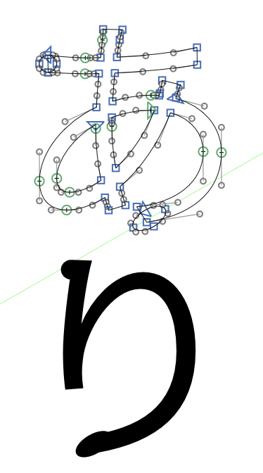

# ShowRemmenDirection.glyphsReporter

This is a plugin for the [Glyphs font editor](https://glyphsapp.com/) by Georg Seifert.
It displays the remmen direction in the glyph view.

### Installation

1. Download the complete ZIP file and unpack it, or clone the repository.
2. Double click the .glyphsReporter file. Confirm the dialog that appears in Glyphs.
3. Restart Glyphs

### Requirements

The plugin requires app version 2.4.1 (983) or later, running on OS X 10.12.3 or later. (Merely I confirmed the plugin only under these conditions...)

### License

Copyright 2017 derwind

Made possible with the GlyphsSDK by Georg Seifert (@schriftgestalt) and Rainer Erich Scheichelbauer (@mekkablue).

Licensed under the Apache License, Version 2.0 (the "License");
you may not use this file except in compliance with the License.
You may obtain a copy of the License at

http://www.apache.org/licenses/LICENSE-2.0

See the License file included in this repository for further details.
